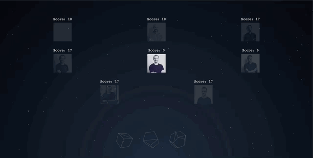

# aoc-leaderboard



Template repository for vizualizing private [Advent of Code](https://adventofcode.com/) leaderboards. 

## Project setup
To install and serve it, run
```
yarn install && yarn serve
```

## Deployment
I deployed it through [Azure Static WebApps](https://azure.microsoft.com/en-us/services/app-service/static/), but it should be possible to do a similar S3 + lambda setup with the same process. 